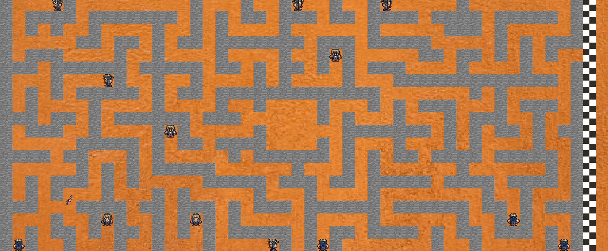
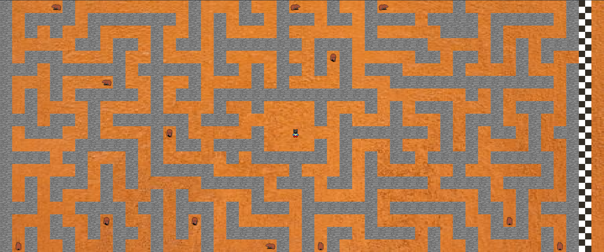

## {frontmatter.title}

This is the project we had to do at the end of our first year of engineering school in teams of 3. The goal was to build a game using the C language and SDL2 and then build a Q-learning algorithm (here: double-Q-learning) to learn solving the game.

Our game is a maze with multiple paths, devided in two parts, to get to the exit, but there is a passage at the center which is mandatory to get to the second part of the game. There are also ennemies located in mutiples dead ends and crossing their line of sight is a game over.

One of the challenge is to find the correct balance of settings for it to learn efficiently. An other challenge is to chose the right perceptions of the IA. In our case, we decided it could see 4 cases around it <code>(UP, RIGHT, DOWN, LEFT)</code> and that he could not go back except in case of a dead end.

We also added a gamemode where the player could solve the maze by himself and we integrated the whole through a menu.

